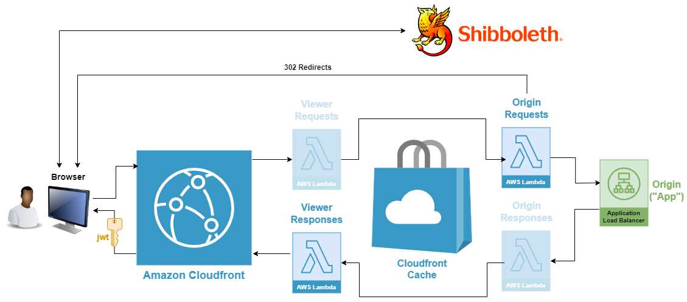
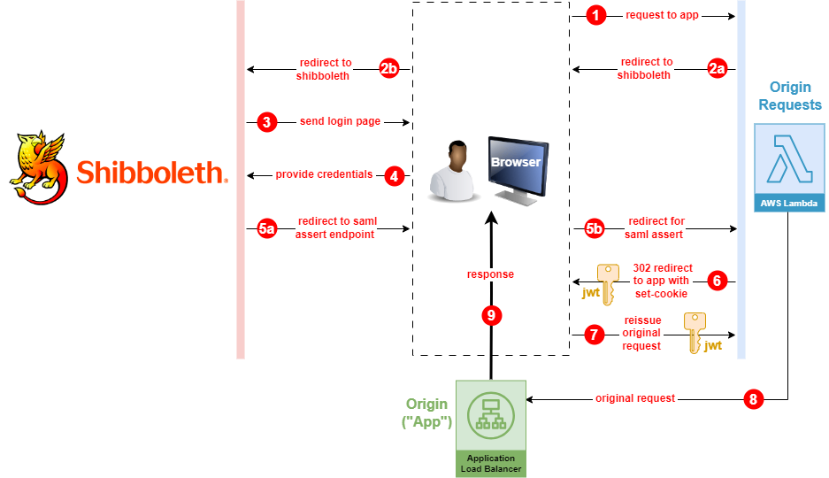

# Shibboleth service-provider "@edge"

This is a sample project for the implementation of a shibboleth service provider in a [lambda@edge](https://docs.aws.amazon.com/AmazonCloudFront/latest/DeveloperGuide/lambda-at-the-edge.html) function.
All http requests go through a [cloudfront distribution](https://docs.aws.amazon.com/AmazonCloudFront/latest/DeveloperGuide/distribution-overview.html) which first passes them through the function to determine authentication status.
The request is processed by the lambda function using the [shibboleth-sp](https://www.npmjs.com/package/shibboleth-sp) library to either verify authenticated status or drive the authentication process with the shibboleth IDP to get authenticated before passing through to the targeted [origin](https://docs.aws.amazon.com/AmazonCloudFront/latest/DeveloperGuide/DownloadDistS3AndCustomOrigins.html).

### Stack overview



- **Origin request lambda function:**
  This is where the bulk of the work is done. The service provider functionality resides here. Each incoming request has its headers checked for a valid authentication token (jwt) before passing through to the origin. If the token is missing or expired, the saml authentication flow with the shibboleth IDP is started.
  
    >NOTE: This functionality should belong in a viewer request edge lambda, where every request would be processed, despite what's in the cache. However, the 1 MB limit for viewer request lambda code is exceeded, leaving the only choice of origin request lambda with a 50 MB code limit. In order to get the lambda hit for EVERY request, caching is disabled. PENDING A WORKAROUND AS CACHE DISABLING IS JUST AN ESCAPE HATCH.
  
- **Viewer response lambda function:**
  This function merely switches the content-type of the outgoing response from `application/json` to `text/html` 

- **Origin ("App") lambda function:**
  This application that authentication grants access to. In this case a simple lambda function.
  Outside of this simple demo stack, this might be something more conventional, like a container cluster fronted by a load balancer.

### Authentication flow:

A more detailed view of the interaction between the end-user, origin request lambda, and app is depicted in the following diagram:



### Build/Rebuild

**Prequisites :**

- AWS command line interface (CLI)
- Admin role in target aws account *(ie: `"Shibboleth-InfraMgt"`)*

**Build:**

1. Put your AWS profile in the environment:

   ```
   export AWS_PROFILE=[your profile]
   ```

2. Set the values for the [Runtime Context](https://docs.aws.amazon.com/cdk/v2/guide/context.html) by modifying the `./context/context.json` file accordingly.
   Most fields in `./context/context.json` are self-explanatory, but any additional explanation that might be needed can be found [here](./context/README.md).
   
2. Deploy the stack from scratch

   ```
   cdk deploy
   ```

   Alternatively, for preventing stack rollback on error and skipping prompts:

   ```
   npm run deploy
   ```

**Teardown:**

- To tear down the stack *(with no prompts)*:

  ```
  cdk destroy -f
  ```

  This command will result in an error if Lambda@Edge functions have been redeployed and thus have multiple versions.
  To avoid this error, the functions for these versions must be deleted.
  A cleanup script has been provided for this purpose:

  ```
  npm run cleanup
  ```

  to see what this script would delete without actually doing so, run:

  ```
  npm run cleanup dryrun
  ```

**Rebuild:**

- To cleanup, destroy the stack, and rebuild it in one non-prompted command:

  ```
  export AWS_PROFILE=bu && npm run cleanup && npm run redeploy
  ```

### Testing

To run all unit tests:

```
npm run test
```

Deeper dives into unit testing and logging:

- [Jest unit testing: Lambda@Edge event object mocking](./docs/testing-lambda-event-mocking.md)
- [Jest unit testing: ESM support](./docs/testing-esm-support.md)
- [Jest unit testing: Gotchas](./docs/testing-gotchas.md)
- [Where are the Lambda@Edge cloudwatch logs?](./docs/testing-lambda-at-edge-logs.md)


## References

- [Handling Redirects@Edge Part 1](https://aws.amazon.com/blogs/networking-and-content-delivery/handling-redirectsedge-part1/)

- [Securing and Accessing Secrets from Lambda@Edge using AWS Secrets Manager](https://aws.amazon.com/blogs/networking-and-content-delivery/securing-and-accessing-secrets-from-lambdaedge-using-aws-secrets-manager/)

- [Using Amazon CloudFront with AWS Lambda as origin to accelerate your web applications](https://aws.amazon.com/blogs/networking-and-content-delivery/using-amazon-cloudfront-with-aws-lambda-as-origin-to-accelerate-your-web-applications/)

  
