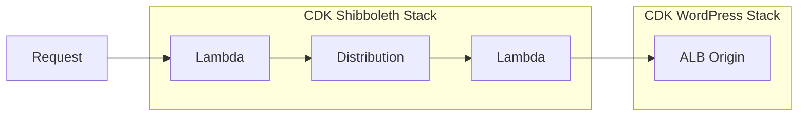
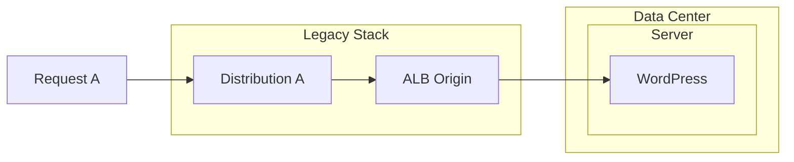
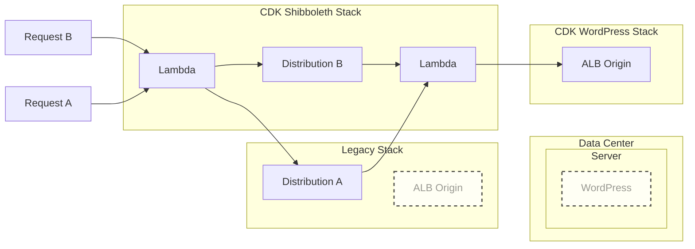

# Origin Swap

## Overview

The `bu-lambda-shibboleth` application is a CDK-based project that deploys a CloudFront distribution with Lambda@Edge functions for Shibboleth authentication. The CDK stack creates:

- A CloudFront distribution with an origin pointing to a backend (e.g., an ALB from the `bu-wp-ecs` app)
- Lambda@Edge functions for viewer request/response and origin request/response events
- Associated IAM roles, log groups, and other resources

The distribution includes cache behaviors that forward specific headers (like `Host`, `Referer`, `User-Agent`, `X-Upstream`) and query strings for proper authentication flow. Edge functions handle SAML assertion processing, login/logout redirects, and metadata serving.



## Origin Swap Scenario

While the CDK deployment creates a complete distribution from scratch, there may be scenarios where another existing CloudFront distribution created elsewhere needs to be involved. 
For example, the pre-existing distributions originally involved with the Boston University WebRouter stack to hook them up with ALBs that point back to data center servers where WordPress is hosted.
In this circumstance, such a pre-existing distribution needs to be:

1. Relieved of its current origin (e.g., the legacy ALB)
2. Repointed to the new origin (e.g., the ALB created by the `bu-wp-ecs` stack)
3. Modified to include the necessary cache fragmentation headers and behaviors for Shibboleth authentication
4. Have the Lambda@Edge functions from the CDK stack attached to it.

### Initial State
***


### Target State
***
 



## Components

### ExampleDistribution.ts
Creates a new CloudFront distribution with a Lambda function URL as the origin. This demonstrates the SDK-based creation of a distribution that mirrors the CDK-created one but uses a function URL instead of an ALB.

### ExampleFunctionUrl.ts
Manages the lifecycle of a Lambda function with a function URL. Includes:
- Creating the Lambda function with inline code
- Setting up the function URL with public access
- Adding CloudFront permissions to invoke the URL
- Deleting the function and associated resources

### ExampleFunctionUrlLogGroup.ts
Handles CloudWatch log group creation and deletion for the Lambda function, including setting retention policies.

### ExampleFunctionUrlRole.ts
Manages the IAM role for the Lambda function execution, including policy attachments and cleanup.

### OriginSwap.ts
Provides the core "swap" functionality to mutate an existing CloudFront distribution:
- Adds APP_* headers to the default cache behavior for cache fragmentation
- Creates additional cache behaviors for authentication paths with no caching
- Attaches Lambda@Edge functions to all behaviors (default and auth paths)

## Usage

The components can be run individually or orchestrated. For example:

```typescript
// Create a distribution with function URL origin
await new ExampleDistribution({ id: 'test-dist', region: 'us-east-1' }).create();

// Later, mutate an existing distribution
const swapper = new TargetDistribution({
  distributionId: 'EXISTING_DIST_ID',
  defaultBUCachingPolicyId: 'YOUR_CACHE_POLICY_ID',
  edgeFunctions: [/* Lambda@Edge ARNs */],
  newOriginId: 'EXISTING_ORIGIN_ID' // Optional, for origin swap
});
await swapper.swapOriginAndBehaviors();
```

This approach allows flexible integration with existing CloudFront infrastructure while leveraging the authentication logic developed in the CDK portion of the application.