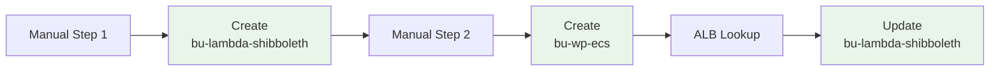
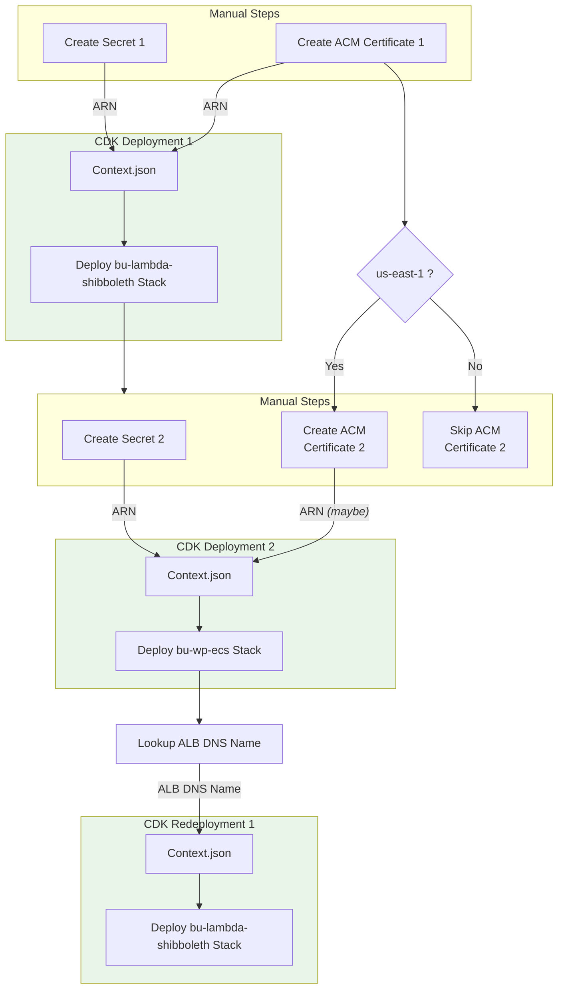

# Deployment Runbook for Boston University Shibboleth SP cloud deployment
 
This runbook provides step-by-step instructions for deploying this AWS CDK app for a Boston University AWS cloud deployment of the Shibboleth service provider module. This module is packaged via npm into a Lambda@edge function and deployed to serve as the authentication point for Boston University Wordpress websites.

The following outlines the necessary prerequisites, configuration steps, and deployment commands to successfully set up the infrastructure.
 
## Deployment Steps

1. Follow the "Prerequisites" steps 1 through 5 in the **[Main Readme File](../README.md)**

2. Follow the "Build Steps" 1 through 6 in the **[Main Readme File](../README.md)**

3. Backup the `./context/context.json` file:

   ```bash
   cp ./context/context.json ./context/context.json.bak
   ```

4. Open the context file located at [`./context/context.json`](./context/context.json). It comes pre-populated with a JSON object comprising example values for most of the necessary parameters for a BU WordPress deployment. Most of the following steps will have you modify or confirm a few of the values of the JSON object.

5. In `./context/context.json`, set the `ACCOUNT` and `REGION` values to the appropriate AWS account and region you will be deploying into. These should match the AWS CLI profile you are using.

6. In `./context/context.json`, set the `TAGS.Landscape` value to the appropriate landscape/environment name you are deploying into. This value will be integrated into the name of the stack and the names of most of the resources created by the stack.

7. You may have a custom domain set up as a hosted zone in Route 53 intended for requests to the cloudfront distribution created by this stack. If so, in `./context/context.json`, set the `DNS` properties accordingly:
   - `DNS.hostedZone`: Set this to the Route 53 hosted zone name (e.g., `example.edu`).
   - `DNS.certificateArn`: Set this to the ARN of an existing ACM certificate in us-east-1 that covers the desired domain/subdomain (e.g., `wp.example.edu`). *NOTE: This certificate must be in us-east-1 as CloudFront only supports ACM certificates from that region.*

   NOTE: If you do not have a custom domain set up, blank out both of these properties as empty strings (`""`).

   NOTE: If you have a custom domain set up, but have no matching certificate in ACM, go to the ACM serice in the AWS management console in us-east-1 and request it before proceeding.

8. Secrets Manager:
   - In `./context/context.json`, replace the placeholder value for the `SHIBBOLETH.secret.secretArn` as per step 6 in the **[Main Readme File](../README.md)**.

   - In `./context/context.json` of the targeted origin stack for WordPress, whether deployed or not, you should make the corresponding change to the `WORDPRESS.secret.spSecretArn` value in its context.json file by setting it to the same ARN value you set for `SHIBBOLETH.secret.secretArn`. 

9. This stack creates a cloudfront distribution that will target an **[ALB Origin](https://docs.aws.amazon.com/AmazonCloudFront/latest/DeveloperGuide/DownloadDistS3AndCustomOrigins.html#concept_elb_origin)**. In a typical scenario, it is anticipated that ALB does not exist yet. For the Boston Univerity deployment, the companion `bu-wp-ecs` stack that creates an ALB for a fargate cluster hosting WordPress containers may not yet be deployed. That presents a problem, because the Cloudfront distribution needs to know the ALB's DNS name at deployment time. To account for this, you can do one of the following:
   - Leave the `ORIGIN` property the way it is. A lookup that runs as part of the deployment process will first attempt to find the ALB that is currently specified in `ORIGIN.dnsName`. If it is not found, the deployment proceeds as if the ORIGIN property had been removed *(see the next bullet item)*.
   - Remove the ORIGIN property altogether. When this is done, a [function URL](https://docs.aws.amazon.com/AmazonCloudFront/latest/DeveloperGuide/DownloadDistS3AndCustomOrigins.html#concept_lambda_function_url) is set up to serve as a default [HttpOrigin](https://docs.aws.amazon.com/cdk/api/v2/docs/aws-cdk-lib.aws_cloudfront_origins.HttpOrigin.html) that will simply spit out request parameters and accommodate authentication.

10. Deploy the stack from scratch with the [CDK deploy command](https://docs.aws.amazon.com/cdk/v2/guide/cli.html#cli-deploy):

   ```
   cdk deploy
   ```

   Alternatively, for preventing stack rollback on error and skipping prompts:

   ```
   npm run deploy
   ``` 

11. Smoke Test: After deployment, access the test origin by the `TestOriginURL` output value for the resulting cloudformation stack. You should be able to login and view all of your shibboleth attributes displayed in the browser.

    If you had already deployed the WordPress fargate stack and the ALB was available as an origin at deployment time, you can also access the WordPress site through the `CloudFrontDistributionURL` output value. And you are finished with deployement! Otherwise, proceed to step 12.

12. Deploy the WordPress fargate stack as per the instructions in its companion runbook.

13. After the WordPress fargate stack is deployed, you need to update the cloudfront distribution created by this stack to point to the ALB as the origin. In `./context/context.json`, set the `ORIGIN.dnsName` property to the ALB DNS name, and repeat step 10 to update the stack.

## Deployment Process Flow

The deployment process involves interdependent configuration between the `bu-lambda-shibboleth` and `bu-wp-ecs` stacks. Two separate secrets must be created beforehand, and their ARNs configured in the respective context files. There are 3 separate deployments (2 creations and 1 update) interspersed with manual steps, as illustrated below:

### Basic



### Detailed
The following diagram illustrates the prerequisite setup and 3-step deployment sequence in detail:

