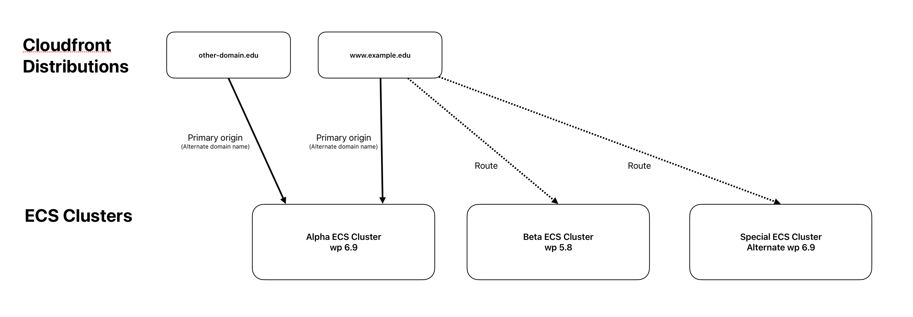

# Request Routing Layer

Routing in CloudFront can be implemented by modifying the `request.origin` property in a Lambda@Edge function. Some distributions may benefit from a routing function that can be optionally layered on top of the authentication function.

## Overview

The routing layer enables a single CloudFront distribution with one authentication stack to serve multiple backend clusters or static origins. Requests are directed to different backend ALBs, S3 origins, or redirects based on URL path patterns, without duplicating the Shibboleth authentication infrastructure.

The viewer-request stage in these distributions is occupied by JWT validation; routing is therefore composed at origin-request, where the auth handler already runs and origin modification is straightforward. The routing function is implemented as a wrapper around the existing origin-request handler.

## Architecture

The diagram below shows the topology that the routing layer enables: distributions and clusters become independently changeable. Routing-enabled distributions can direct traffic to any cluster ALB; non-routing distributions remain pinned to their primary origin.



The routing layer is a path-based router that runs after JWT validation but before SAML processing — added to the existing origin-request Lambda by way of a thin wrapper that delegates to the (unchanged) auth handler.

When `ROUTING.enabled` is true in context.json, the CDK synthesis-time decision in [lib/EdgeFunctionOriginRequest.ts](../../lib/EdgeFunctionOriginRequest.ts) deploys `routing-handler.js` instead of `edge-origin-request.js`. When routing is disabled or absent, the deployed function is the auth-only handler — unaltered from the pre-routing versions. The feature is fully opt-in: with `ROUTING.enabled` set to false or omitted, no DynamoDB resources are created and no routing code is bundled into the Lambda.

### Request Flow

When routing is enabled, the request flow looks like this:

```
User → CloudFront
         ↓
     Viewer-Request Lambda (JWT validation)
         ↓
     Origin-Request Lambda (routing + SAML + auth)
         ↓
     Selected Origin (based on DynamoDB rules)
```

### Components

**Origin-Request Lambda** ([lib/lambda/routing/routing-handler.ts](../../lib/lambda/routing/routing-handler.ts))
Queries DynamoDB for routing rules based on request path, modifies `request.origin` if a rule matches, then delegates to the auth handler. Preserves all auth handler functionality (SAML, JWT, security headers).

**DynamoDB Routing Table**
Persistent storage for routing rules, cached in-memory at module scope within the Lambda. The caching pattern (module-level Map with TTL) follows `bu-protected-s3-object-lambda`; the access pattern (Scan rather than Get) differs for functional reasons — see [Why DynamoDB](#why-dynamodb) below.

## Design Principles

### Distributions and clusters can be independently associated

A single CloudFront distribution can route to any backend cluster, and a single cluster can be reached from any distribution. 

### Routing is Opt-in

When `ROUTING.enabled` is false or absent, the deployed Lambda is byte-for-byte identical to the pre-routing version, no DynamoDB resources are created, and no routing code is bundled into the Lambda. The feature adds functionality only for distributions that elect to use it. Distributions that do not opt in are unaffected by the routing components.

### Coexistence with the auth handler

The routing handler does not modify any properties that are used by the auth handler. Two specific constraints follow this requirement:

**Empty `customHeaders`.** The routing handler must set `request.origin.custom.customHeaders = {}` when modifying origin. CloudFront returns 502 "invalid origin configuration" if the same header exists in both `origin.custom.customHeaders` and `request.headers` simultaneously. The auth handler adds security headers (`cloudfront-challenge`, `app_authorization`) to `request.headers`. Pre-populating `customHeaders` in the routing handler creates dual-location state and triggers the 502.

**Host header preserved.** The routing handler modifies `request.origin.custom.domainName` (the ALB DNS name CloudFront uses for the TLS handshake and connection routing) but does not modify `request.headers['host']`. WordPress uses `Host` for site selection within a multisite cluster. Modifying it would break multisite routing on the cluster side.

Both constraints are documented at the source — see the comment block in `applyRoutingRule` in [routing-handler.ts](../../lib/lambda/routing/routing-handler.ts) — and verified at the cache-behavior level by [lib/Distribution.test.ts](../../lib/Distribution.test.ts) for SAML path exclusion.

### The runtime data plane has no opinion about source of truth

The Lambda reads from DynamoDB. It does not assume anything about how rules got there. Direct console editing, a CLI script that upserts a YAML file, a GitHub Action triggered on PR-merge, an internal UI, or a `sites.map`-to-DynamoDB transformer can all coexist as paths to populate the same table — they only have to conform to the rule contract defined in [types.ts](../../lib/lambda/routing/types.ts). This is a deliberate decoupling: it lets the right write path emerge from real use rather than being committed to up front, and any future write path needs only to conform to the schema.

## Configuration

### Enabling routing (context.json)

```json
{
  "ROUTING": {
    "enabled": true,
    "tableName": "custom-routing-table",
    "cacheTtlSeconds": 300
  }
}
```

**Context fields:**

- `enabled` — Boolean. Absence or false deploys the distribution without routing (zero added resources).
- `tableName` — (Optional) Override default DynamoDB table name. Default: `{STACK_ID}-routing-table-{Landscape}`
- `cacheTtlSeconds` — (Optional) Cache TTL in seconds. Default: 300 (5 minutes)

When `ROUTING.enabled` is false or absent, the deployed function is `edge-origin-request.js` (auth only, estimated at 3.7 MB). When enabled, the deployed function is `routing-handler.js` (routing + auth, estimated at 5.0 MB). The size difference is the bundled DynamoDB SDK (the Lambda runtime does not include the DynamoDB client).

### Build requirement

Context changes are bundled into Lambda code at build time:

```bash
npm run build    # Required after context.json changes
cdk deploy       # Deploys new Lambda version
```

### DynamoDB table

The routing rules consumed by the handler are stored in a per-stack DynamoDB table provisioned by the CDK construct when `ROUTING.enabled` is true.

- **Table name:** `{STACK_ID}-routing-table-{Landscape}`
- **Schema:** Partition key `path` (string), attributes vary by action type

**Path matching:** Paths are case-insensitive. Both keys and lookups are normalized to lowercase - see [Rule Matching Behavior](#rule-matching-behavior) below.

Example rules:

```json
{
  "path": "/special",
  "action": "origin",
  "target": "special-alb-123.us-east-2.elb.amazonaws.com",
  "matchType": "prefix",
  "enabled": true
}
```

```json
{
  "path": "/studentlink",
  "action": "redirect",
  "matchType": "exact",
  "redirectStatus": 301,
  "target": "https://www.example.edu/link",
  "preserveQuery": false,
  "enabled": true
}
```

## Why DynamoDB

An obvious question when reviewing this implementation: *if the Lambda loads the whole table on every cache event, why use DynamoDB at all? Why not a JSON file in S3, or a parameter in SSM?*

### The ability to support longest-prefix-match favors "load everything"

It can be beneficial to use a matching algorithm that is longest-prefix-match over URL paths. A request for `/cas/biology/faculty/smith` walks the path hierarchy from longest to shortest (`/cas/biology/faculty` → `/cas/biology` → `/cas`) and returns the first matching rule. There is no single key the Lambda can compute up front to retrieve one rule. The alternative — issuing five to ten single-key `Get` requests per incoming request to walk the prefix chain, most of which would miss — trades one warm-container Scan for sustained per-request latency. Loading the full table once per container and matching in memory is a good match for this scenario **regardless of the storage medium**.

### Once "load everything" is decided, storage choice is operational

DynamoDB has two beneficial properties for this use case:

1. **Atomic per-rule writes.** A `PutItem` call is safe under concurrent edits. An S3-backed JSON file requires read-modify-write with locking or last-writer-wins semantics. Both are error-prone when multiple team members edit rules simultaneously.

2. **Console editor.** The AWS DynamoDB console provides a usable per-item editor out of the box. This matters most during Phase 1, when cluster assignments are mutated occasionally by team members for whom "edit the JSON blob in S3" is friction. An S3-backed JSON file is cheaper on paper but worse operationally.

### Cached DynamoDB is a previously used pattern, but we are using it in a different way

The `bu-protected-s3-object-lambda` project is a partial precedent. The **module-level container caching pattern with TTL** is the same: compare `cachedProtectedSites` in `app.js` to `RoutingCache.ts`'s exported state. The **DynamoDB access pattern is different**: the S3 object lambda does a single `GetItem` against `PK='PROTECTED_SITES'` and `JSON.parse`s a blob, plus per-group `GetItem`s by composite key. It does not Scan.

The routing table Scans in order to support longest-prefix-match, which needs the whole table. The S3 object lambda doesn't Scan because its lookups are exact-key.

### Why not store the whole table as one JSON-encoded item?

A single item at `PK='ROUTING_TABLE'` containing the full rule set as a JSON blob would be mechanically closer to the S3 object lambda's access pattern; one `GetItem`, one `JSON.parse`, then populate the in-memory Map. The reason not to do this: **the AWS console editor operates at the item level**. One giant JSON blob defeats the console editor, and the console editor is a primary motivation for choosing DynamoDB in the first place. The row-per-rule design is the right one. The Scan is the cost of admission.

## Routing Actions

The schema uses two action types: `origin` and `redirect`.

### origin

Modifies `request.origin` to direct traffic to a different ALB or S3 origin. The auth handler runs after origin modification.

**Fields:**
- `action: 'origin'` — Required discriminator
- `path: string` — Required. URL path to match (case-insensitive).
- `target: string` — Required. ALB DNS name or S3 domain **WITHOUT scheme and WITHOUT path**.  
  Valid: `'wp-cluster-alb-123.us-east-2.elb.amazonaws.com'`  
  Invalid: `'https://wp-cluster-alb-123.us-east-2.elb.amazonaws.com'` (includes scheme)  
  Invalid: `'wp-cluster-alb-123.us-east-2.elb.amazonaws.com/path'` (includes path)  
  Confusing origin and redirect target formats causes 502 (unreachable origin) or redirect loops.
- `matchType?: 'exact' | 'prefix'` — Optional, defaults to `'prefix'`.  
  `'exact'`: Rule matches only the literal path. Request for `/studentlink/foo` does NOT match rule `/studentlink`.  
  `'prefix'`: Rule matches the path and all sub-paths (current behavior).
- `rewriteHostHeader?: boolean` — Optional, defaults to `false`. When `true`, sets the Host header to `target` before forwarding to origin. Required for S3 website endpoints (which use Host to determine bucket/content). Must remain `false` for ALB origins serving WordPress multisite (which uses Host for site selection).
- `originPath?: string` — Optional, omit for no prefix. CloudFront's native origin-path mechanism prepends this string to the request URI. Example: `/admissions` with `originPath: '/_domains/example.com'` becomes `/_domains/example.com/admissions` at origin. Use for origins serving multiple logical hosts via path namespacing. Format: must start with `/`, must NOT end with `/`.
- `enabled?: boolean` — Optional, defaults to `true`. When `false`, the rule is filtered out by the cache layer at load time.
- `metadata?: object` — Optional audit fields (`createdAt`, `updatedAt`, `createdBy`). Populated by write tools, not enforced.
- `description?: string` — Optional human-readable description.

**Handler behavior:**

```javascript
request.origin = {
  custom: {
    domainName: rule.target,  // ALB DNS name or S3 domain
    port: 443,
    protocol: 'https',
    customHeaders: {},  // Empty - auth handler adds headers to request.headers
    path: rule.originPath || '',  // Origin path prefix if provided
    sslProtocols: ['TLSv1.2'],
    readTimeout: 60,
    keepaliveTimeout: 5
  }
};

// Conditionally rewrite Host header for S3 origins
if (rule.rewriteHostHeader) {
  request.headers.host = [{ key: 'Host', value: rule.target }];
}
```

### redirect

Returns a redirect response immediately without contacting origin or running the auth handler.

**Fields:**
- `action: 'redirect'` — Required discriminator
- `path: string` — Required. URL path to match (case-insensitive).
- `target: string` — Required. Fully-qualified URL **WITH scheme**.  
  Valid: `'https://www.example.edu/admissions'`  
  Invalid: `'www.example.edu/admissions'` (missing scheme)
- `redirectStatus: 301 | 302 | 303 | 307 | 308` — Required. HTTP redirect status code.  
  `301`: Moved Permanently  
  `302`: Found (temporary)  
  `303`: See Other  
  `307`: Temporary Redirect (preserves method)  
  `308`: Permanent Redirect (preserves method)
- `preserveQuery?: boolean` — Optional, defaults to `false`. When `true`, appends `request.querystring` to the redirect target.  
  Example: Request `/old?foo=1`, target `https://new.example.com`, produces `Location: https://new.example.com?foo=1`.
- `preservePath?: boolean` — Optional, defaults to `false`. When `true`, appends the original request URI to the redirect target. Example: Request `/parking/permits/staff`, target `https://www.bu.edu/parking-and-transportation`, produces `Location: https://www.bu.edu/parking-and-transportation/parking/permits/staff`. Combines with `preserveQuery` (path appended first, then query).
- `matchType?: 'exact' | 'prefix'` — Optional, defaults to `'prefix'`. Same semantics as origin rules.
- `enabled?: boolean` — Optional, defaults to `true`.
- `metadata?: object` — Optional audit fields.
- `description?: string` — Optional description.

**Handler behavior:**

```javascript
let redirectTarget = rule.target;

// Append original request URI if preservePath is true
if (rule.preservePath && request.uri) {
  redirectTarget = `${rule.target}${request.uri}`;
}

// Append query string if preserveQuery is true
if (rule.preserveQuery && request.querystring) {
  const separator = redirectTarget.includes('?') ? '&' : '?';
  redirectTarget = `${redirectTarget}${separator}${request.querystring}`;
}

return {
  status: rule.redirectStatus,
  statusDescription: 'Moved Permanently',  // or 'Found', etc.
  headers: {
    location: [{ key: 'Location', value: redirectTarget }]
  }
};
```

## Rule Matching Behavior

### Longest-prefix-match algorithm

For prefix-match rules (`matchType: 'prefix'` or omitted), the handler walks the path hierarchy from longest to shortest:

- Request `/cas/biology/faculty/smith`
- Tries: `/cas/biology/faculty/smith` (exact), `/cas/biology/faculty`, `/cas/biology`, `/cas`, `/`
- Returns first matching prefix rule

### Exact-match rules

Rules with `matchType: 'exact'` match only the literal path. Sub-paths fall through to the next matching rule or the default origin.

- Rule: `{path: '/studentlink', matchType: 'exact'}`
- Request `/studentlink` → matches
- Request `/studentlink/foo` → does NOT match, falls through

### Disabled rules

Rules with `enabled: false` are filtered out by the cache layer at load time. The handler does not see them. Re-enabling a rule (flipping `enabled: false` → `true` in DynamoDB) takes effect on the next cache refresh (up to `cacheTtlSeconds`, typically 5 minutes).

### Case-insensitivity

All paths are normalized to lowercase during lookup. WordPress routes are de-facto case-insensitive at BU. This is a semantic choice, documented at the source in `RoutingCache.ts` and `types.ts`.

## Performance

The cache pattern (module-level Map with TTL) is designed for sub-millisecond lookups on warm containers. Cold-start cost is bounded by SDK initialization plus a single DynamoDB Scan, and the Scan response is itself bounded (1 MB single-page response, with pagination implemented in [RoutingCache.ts](../../lib/lambda/routing/RoutingCache.ts) for tables that exceed it). Cache refresh latency is bounded by the same shape.

Specific characterization — a clean decomposition of cold-container, cache-miss, and cache-hit costs — is a forthcoming dedicated work stream. Current theory is that the resulting latencies should be acceptable for the routing layer's role; measurement will confirm and will inform decisions about cache TTL, observability, and scale ceilings before any production rollout.

## Operational Considerations

### Deployment

Routing rule changes in DynamoDB take effect within the cache TTL (default 5 minutes). No Lambda redeployment is needed unless routing logic changes.

### Testing

- Unit tests: [lib/lambda/routing/routing-handler.test.ts](../../lib/lambda/routing/routing-handler.test.ts)
- CDK construct tests: [lib/Distribution.test.ts](../../lib/Distribution.test.ts) (SAML path exclusion)

## Troubleshooting

### 502 "Invalid origin configuration"

CloudFront returns 502 with an error message mentioning "HeaderName or HeaderValue values are invalid."

**Cause:** A header exists in both `origin.custom.customHeaders` and `request.headers` simultaneously.

**Solution:** Verify that the routing handler sets `customHeaders: {}`. Check Lambda logs for the auth handler reporting headers in customHeaders — this indicates that the routing handler violated the empty-customHeaders invariant.

### Routing not applied

Requests go to the default origin even when a DynamoDB rule exists.

**Causes:**

1. Context not rebuilt — run `npm run build` after changing `ROUTING.enabled`.
2. In-memory cache stale — the Lambda module-level cache holds the routing table for up to `cacheTtlSeconds` (default 5 minutes) after each refresh. Wait for the next refresh after rule updates.
3. Path doesn't match — check the exact path in DynamoDB against the request URL.

**Debug:** Check Lambda@Edge logs in CloudWatch Logs. The handler logs routing decisions with `[Routing]` prefix.

## Known Limitations

1. **Regex not supported.** Path matching is exact or prefix-based only. Complex patterns require multiple rules or upstream/downstream transformation.
2. **Single-table Scan design.** Partitioning may be necessary above ~3,000 rules if Scan latency becomes problematic (the 1 MB Scan response limit is the ceiling).
3. **Cold-start DynamoDB query.** The first request after a Lambda cold start queries DynamoDB (no cache yet). Warm containers use the in-memory cache. Performance characterization is pending — see [Performance](#performance).
4. **Re-enable latency.** Disabled rules take up to `cacheTtlSeconds` (default 5 minutes) to take effect after re-enabling.
5. **Manual rule management.** No built-in validation or write tooling yet. Rules are edited via AWS console or custom scripts.

## Related Code

- [lib/lambda/routing/routing-handler.ts](../../lib/lambda/routing/routing-handler.ts) — Implementation
- [lib/lambda/routing/types.ts](../../lib/lambda/routing/types.ts) — Schema contract