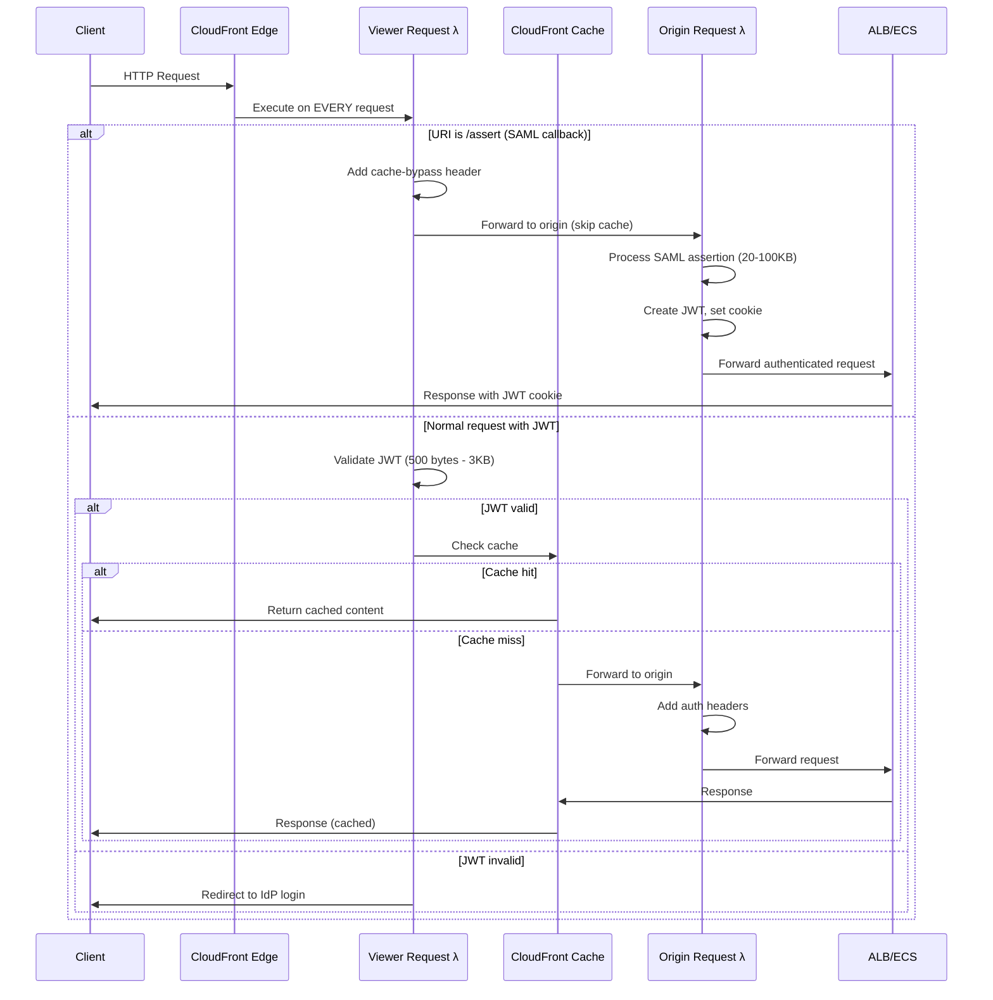

# Lambda@Edge Authentication Architecture

## Overview

Authentication processing is strategically split between **Viewer Request** and **Origin Request** Lambda@Edge functions to optimize performance while respecting AWS size limitations.

## Request Flow

## Why Split Authentication?

### Size Limitations
- **Viewer Request**: 40 KB body size limit
- **Origin Request**: 1 MB body size limit

### Token Sizes
- **JWT tokens**: 500 bytes - 3 KB (header + payload + signature)
- **SAML assertions**: 20-100+ KB (Base64-encoded XML with attributes, groups, encryption)

### Performance Optimization

**Viewer Request Lambda** (runs on EVERY request, including cache hits):
- ✅ Validates JWT tokens (small, fast)
- ✅ Enforces authentication before cache
- ✅ Detects SAML callbacks and bypasses cache
- ✅ Minimal processing overhead

**Origin Request Lambda** (runs only on cache misses):
- ✅ Processes large SAML assertions (requires 1 MB limit)
- ✅ Handles IdP callbacks and token generation
- ✅ Adds authorization headers to origin requests
- ✅ Only executes when necessary

### Why Not Consolidate All Auth in Origin Request?

If all authentication logic was moved to origin request:
- ❌ **Caching must be disabled** - every request needs auth check
- ❌ **Performance degradation** - all requests hit origin
- ❌ **Increased origin load** - no cache protection
- ❌ **Higher latency** - no edge caching benefits
- ❌ **Increased costs** - more origin requests, more data transfer

By handling JWT validation in viewer request, authenticated users benefit from CloudFront's edge cache while still maintaining security on every request.

## Special Handling: SAML Assertion Callback

The `/assert` path (SAML callback from IdP) receives POST requests with large SAML assertions that:
1. Exceed the 40 KB viewer request limit
2. Must skip cache to be processed
3. Are handled by origin request Lambda (1 MB limit)
4. Result in JWT creation and cookie setting

The viewer request Lambda detects this path and adds a cache-bypass header, ensuring the request flows directly to origin request Lambda for processing.
